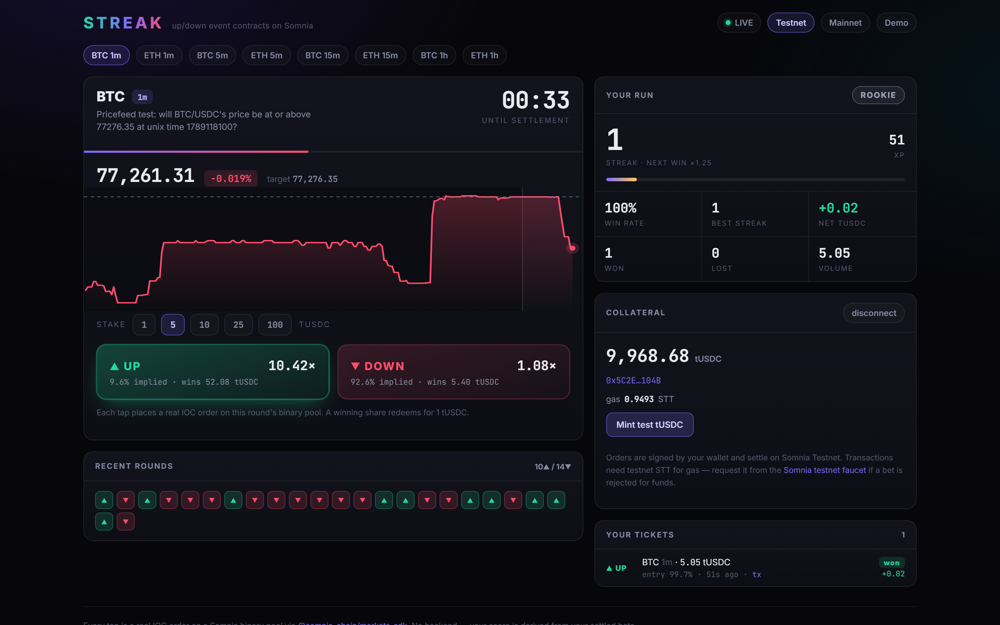
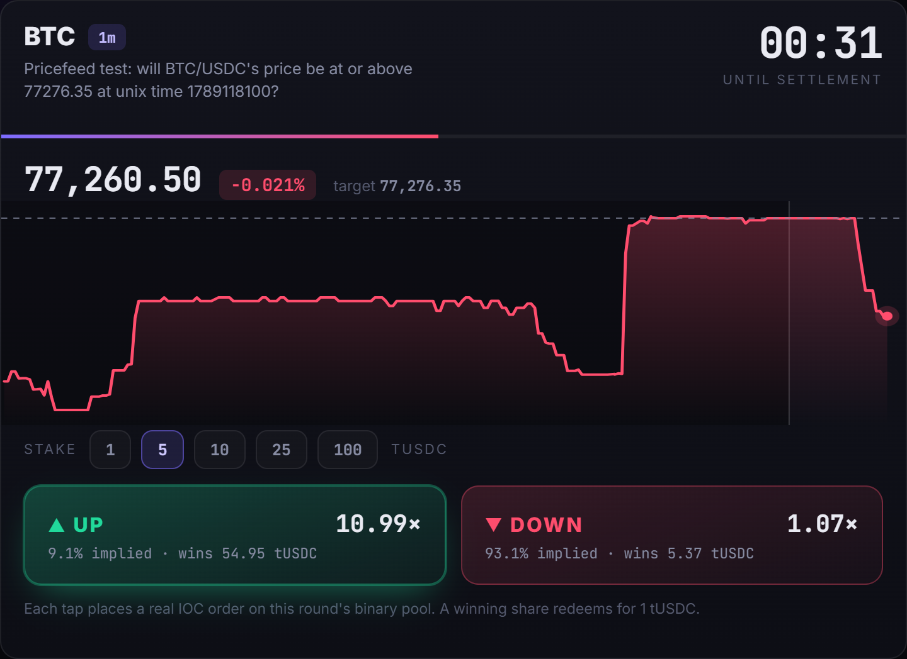
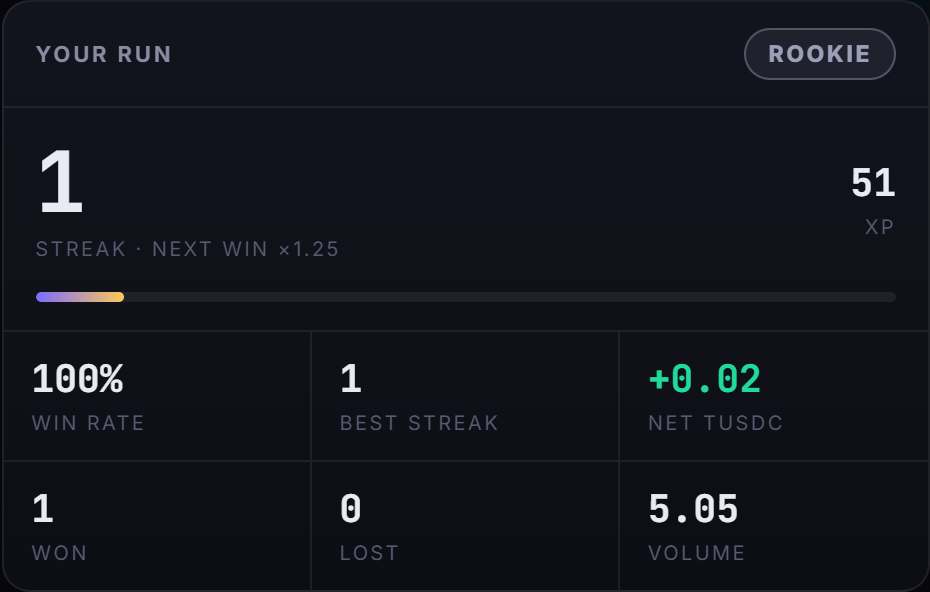
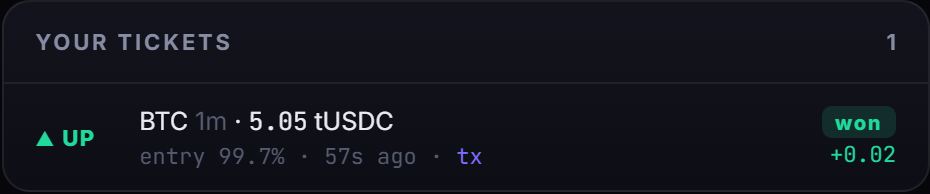
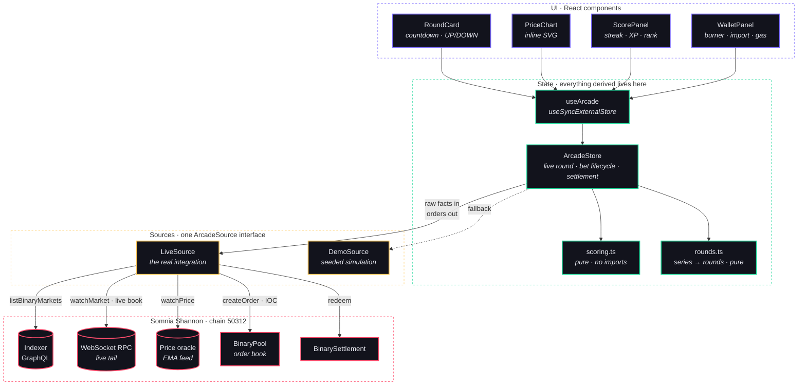
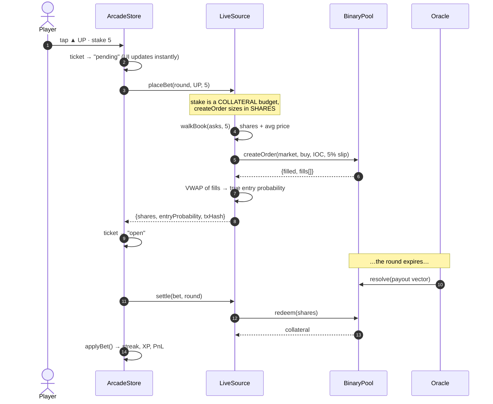
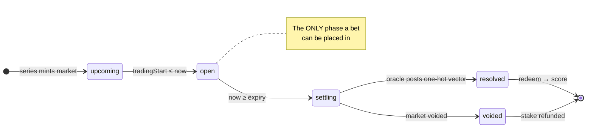
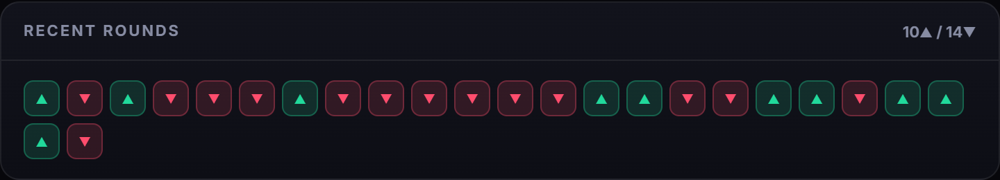

<h1 align="center">STREAK</h1>

<p align="center"><b>The one-tap Up/Down arcade for Somnia Event Contracts.</b></p>

<p align="center">
  <a href="https://vedlad10.github.io/game/"><b>▶ Live demo</b></a> ·
  <a href="#try-it-in-60-seconds">Try it in 60s</a> ·
  <a href="#architecture">Architecture</a> ·
  <a href="#proven-on-chain">On-chain proof</a> ·
  <a href="./FEEDBACK.md">SDK feedback</a>
</p>

<p align="center">
  
  
  
  
</p>



> Every number on that screen is live from chain. The round, the countdown, the
> price, the two multipliers, the settled ticket — none of it is mocked.

---

## The problem

**Event Contracts have a distribution problem, not a technology problem.** The
order book works. The oracle works. Settlement works. What is missing is a
surface that someone who has never traded will actually use.

The barrier is one specific question. A prediction market asks a newcomer to
**price a probability** — *"YES is at 0.62, is that cheap?"* To answer, you need
a calibrated view **and** you need to know what the price implies. Most people
can't, and won't try. That single question filters out almost everyone who isn't
already a trader.

STREAK asks a different question over the *same trade*:

<table>
<tr><th>A prediction market asks</th><th>STREAK asks</th></tr>
<tr>
<td>Is YES at 0.62 mispriced?</td>
<td>Up or down, before the clock hits zero?</td>
</tr>
<tr>
<td colspan="2" align="center"><i>Underneath, both are a market buy of a YES/NO outcome token on the same binary pool.<br>Only one of them survives contact with a first-time user.</i></td>
</tr>
</table>

The trade doesn't need to change. The question does.

---

## How it works

### 1 · A rolling series becomes a game round

An Event Contract is a binary market on a **rolling series** — a new one every
1m, 5m, 15m or 1h, back to back. STREAK treats each as a round with a countdown.



The dashed line is the **target** the outcome settles against. The chart is the
on-chain EMA price oracle. The line turns green above the target and red below,
so *"am I winning"* needs no arithmetic.

### 2 · One tap is one real order

`▲ UP` buys the YES outcome; `▼ DOWN` buys NO. The multiple on each button comes
from walking the **live order book** — not a house-set payout. The screenshot
above shows UP at `10.42×` and DOWN at `1.08×`: the book thinks DOWN is nearly
certain, so UP pays like the long shot it is.

A tap sends a market **IOC** order to that round's binary pool, signed locally,
confirmed in one round-trip.

### 3 · It settles and scores itself

 

When the oracle resolves the round, the position is redeemed automatically and
the result folds into your run. Every ticket records the **price you actually
got**, because that is what the score is computed from.

---

## Architecture

Two interchangeable sources satisfy one interface, so the entire UI is written
once and never knows which is behind it. That is what lets the arcade degrade to
a clearly-labelled simulation instead of a dead screen.



**The split that carries the design:** sources produce *raw facts*; the store owns
*everything derived*. A source reports markets, prices and fills. The store
decides which round is live, which bets have settled and what the score is. That
is why adding the simulation cost one file and zero changes to the UI.

### What happens when you tap UP



### Round lifecycle

Phase comes from the market's **own timestamps**, not its `status` field — the
SDK documents that `Listed → Trading → Settling` are timestamp-implicit and emit
no event, so `status` can lag the wall clock. Only the terminal states are
trusted from `status`, because those *do* emit.



---

## Scoring: reward being right when the market was wrong

A leaderboard that counts volume just rewards whoever had the most capital. XP is
weighted by **the price you got in at**, which on a binary market *is* the
market's implied probability:

```
xp = 100 × (0.5 + (1 − entryProbability)) × streakMultiplier
```

| Entry price | Market's view | XP for a win |
|---|---|---|
| `0.95` | near-certainty | **55** |
| `0.50` | coin flip | **100** |
| `0.20` | 4:1 long shot | **130** |
| `0.05` | 19:1 long shot | **145** |

The streak multiplier adds `0.25` per consecutive win and caps at `3×`, so a run
is worth protecting but cannot run away.

**There is no backend.** Rank, streak and PnL are a pure function of settled
bets, and every settled bet is an on-chain fill plus an oracle-resolved outcome.
Replay the same fills and you get the same number — anyone can verify a score
without trusting a server, because there is no server.



---

## Proven on-chain

Not "typechecks against the SDK" — **actually filled on Shannon:**

```
symbol   BTC-0-11SEP26-0705/tUSDC#YES
filled   3.824 shares @ 0.55   ·   status: closed
tx       0xc9c14b6280ce2b0ac128f7f64f898eaa7dcac8ab16b3075f9bbbd940536311bc
```

[View on the Shannon explorer →](https://shannon-explorer.somnia.network/tx/0xc9c14b6280ce2b0ac128f7f64f898eaa7dcac8ab16b3075f9bbbd940536311bc)

`npm run preflight` drives the **real** `LiveSource` against the venue in ten
dependency-ordered steps and prints what it finds:

```
status      ready          live round  BTC 1m — 4s left
series      8              price       77372.435   (on-chain oracle)
active      BTC:60         reference   77425.62
odds        UP 0.021       ticks       211
quote UP    47.62×         collateral  tUSDC
```

Running this against a live venue is what found the bugs that mattered — see
[Built by running it](#built-by-running-it).

---

## Try it in 60 seconds

**[vedlad10.github.io/game](https://vedlad10.github.io/game/)**

| | |
|---|---|
| `?mode=demo` | play the simulation — no wallet, no chain, no gas |
| `?network=mainnet` | point at Somnia mainnet instead of testnet |

To trade for real on testnet:

1. Get **STT for gas** from the [Somnia faucet](https://testnet.somnia.network/)
   *(the collateral faucet mints tUSDC, not gas — you need both)*
2. **Connect wallet**, or **Import a funded key**, or **Play with a burner**
3. **Mint test tUSDC** for collateral
4. Pick a side before the countdown hits zero

> A judge opening the live link sees real markets and real odds immediately, but
> cannot place an order without a funded wallet. The app detects this and says so
> with a faucet link, rather than failing with a contract error.

---

## Run it locally

```sh
npm install
npm run dev          # http://localhost:5173/game/
npm test             # 77 tests, no network required
npm run typecheck
npm run build
```

### Verify the live integration

```sh
npm run preflight                                   # read-only, no wallet, no gas
SOMNIA_KEY=0x… npm run preflight                    # + balance, gas and faucet
SOMNIA_KEY=0x… SOMNIA_BET=1 npm run preflight       # + ONE real order
SOMNIA_NETWORK=mainnet npm run preflight            # against mainnet
```

Excluded from `npm test` so the offline suite stays green. Write steps are gated
behind explicit env vars, so no order is ever placed by accident.

---

## Built by running it

The project was developed in a sandbox with no network access to Somnia. The
first run against a live venue found seven bugs that typechecking could never
have caught — each one is a commit with its measurement in the message:

| Bug | What was actually happening |
|---|---|
| **No rounds, ever** | `orderBy: "closingSoon"` sorts by expiry ascending across *every* market the venue ever had. 200 rows came back that expired seven weeks earlier — all Finalized, zero open |
| **Ghost series tabs** | The venue returns `298` *and* `300` for one 5m series, `3599` beside `3600`. Keying on the raw cadence split one series into several, each with its own idea of which round was live |
| **Empty chart** | The price oracle returns its tape **newest-first**. The projection assumed oldest-first, so `span` went negative, clamped to `1`, and threw the line thousands of units off-canvas |
| **No price at all** | The oracle is a *separate* GraphQL endpoint that must be configured explicitly |
| **Permanent "not posted yet"** | Shannon runs **both** fixed-strike and reference-mode contracts. Fixed-strike rounds have no opening price and never will — their threshold is the strike, known at creation |
| **Dead buttons** | Odds came only from the socket-materialized book; when it didn't hydrate, plain RPC showed 3–4 levels a side the whole time |
| **"Missing or invalid parameters"** | Actually an empty gas balance. Now detected up front, named, and linked to the faucet |

---

## Project layout

```
src/
  game/scoring.ts       score from settled bets · pure, no imports
  lib/
    rounds.ts           rolling series → game rounds · pure
    types.ts            the ArcadeSource contract both modes satisfy
    liveSource.ts       SDK, book, oracle, orders, redeem
    demoSource.ts       seeded simulation
    store.ts            derived state, bet lifecycle, settlement
    wallet.ts           burner · injected · imported key
    networks.ts         testnet/mainnet from the SDK's own constants
  components/           round card · chart · score · tickets · wallet
  hooks/useArcade.ts    React binding + live→demo fallback
```

**77 tests** cover phase boundaries, overlapping trading windows, series grouping
with real cadence jitter, streak and void handling, rank progression, book
walking with thin and malformed levels, VWAP fill pricing including the NO-side
complement, and chart projection from a reversed feed.

---

## Built with

[`@somnia-chain/markets-sdk`](https://www.npmjs.com/package/@somnia-chain/markets-sdk)
— the same package the official
[starter template](https://github.com/IronicDeGawd/ec-dreamdex-hackathon-template)
pins — plus `viem`, React 19 and Vite. Contract addresses come from the SDK's
generated constants, never hand-copied.

- [DreamDEX Event Contracts docs](https://docs.dreamdex.io/developers/event-contracts)
- [DreamDEX Bot Kit](https://github.com/somnia-chain/dreamdex-bot-kit)
- [`FEEDBACK.md`](./FEEDBACK.md) — our SDK & documentation feedback report: seven
  concrete points of friction and four things that worked unusually well

---

## Status and limits

- ✅ **Read path verified** end to end against Shannon — markets, series, live
  odds, oracle price, reference level, stake quotes, and a store-level check that
  the full app data path derives a playable round.
- ✅ **Write path proven on-chain** — real IOC order filled, redeemed and scored.
- ⚠️ **Liquidity is a venue property.** A quiet testnet round can be one-sided;
  the UI disables that side rather than showing a price it cannot fill.
- ⚠️ **Gas onboarding is unsolved and not solvable here.** The Somnia faucet is
  captcha-gated with no API, so the app cannot fund a burner for you. It detects
  an empty balance and tells you exactly what to do instead.
- ⚠️ **Not audited, not for real funds.** Testnet is the default for a reason.

The original Ring Runner game that lived in this repo is preserved at
[`/legacy/`](https://vedlad10.github.io/game/legacy/).

MIT.
